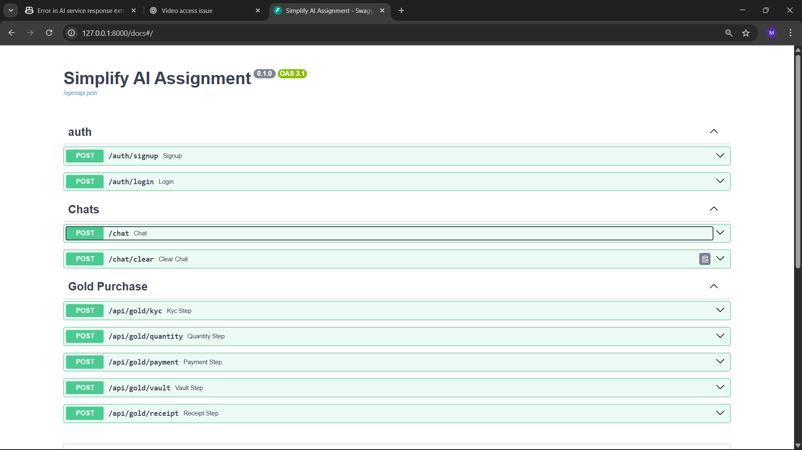

# Simplify Money | AI Chat & Digital Gold Purchase Backend

This backend is now **live**!

## 🚀 Live Deployment

- **API Base URL:** [https://simplify-money-ai-bot-replicate.onrender.com](https://simplify-money-ai-bot-replicate.onrender.com)
- **API Docs (Swagger UI):** [https://simplify-money-ai-bot-replicate.onrender.com/docs](https://simplify-money-ai-bot-replicate.onrender.com/docs)

You can use these endpoints to interact with the API or explore available routes and models.

---



## Table of Contents
1. [Project Overview](#project-overview)
2. [Features](#features)
3. [File Structure](#file-structure)
4. [Workflow Explanation](#workflow-explanation)
5. [Pre-requisites](#pre-requisites)
6. [Environment Setup](#environment-setup)
7. [Running the Application](#running-the-application)
8. [API Reference](#api-reference)
9. [Example Queries & Test Cases](#example-queries--test-cases)
10. [Planned Features & Future Enhancements](#planned-features--future-enhancements)
11. [Solution Summary](#solution-summary)

---

## Project Overview 
This backend project simulates a **financial guidance app** focusing on **digital gold investment**.  
Key functionalities:
- **AI Chat**: Context-aware chat with Gemini AI for intent detection and conversation guidance.
- **Stepwise Gold Purchase**: Simulates KYC, quantity selection, payment, vault/wallet allocation, and receipt generation.
- **SQLite Database**: Tracks users and gold orders.
- **FastAPI**: Provides structured REST endpoints for AI chat and gold purchase steps.

---

## Planned / Future Features
- **Frontend Integration** with React or Flutter.
- **Enhanced Gemini AI prompts** for more natural conversation.
- **Test Cases** for API endpoints and AI responses.
- **User authentication & roles**.
- **Real payment gateway integration**.
- **Live gold price API integration**.
- **Persistent conversation history** stored in database.


---

## File Structure
```
simplify-money-assignment/
│
│
├── core/
│   ├── prompts.py             # Gemini AI & Chatbot prompt construction
│   ├── chat_flow.py           # Handles query processing, intent detection, integrates stepwise gold purchase
│   └── chat_manager.py        # Conversation history management (add, get, clear)
│
├── database/
│   ├── db.py                  # SQLite connection & session management
│   └── models.py              # SQLModel definitions: User, GoldOrder
│
├── routers/
│   ├── chat.py                # /api/chat endpoints with history
│   └── gold.py                # /api/gold/* endpoints (KYC → Receipt)
|
├── services/
│   ├── gemini_service.py      # Gemini AI API interaction
│   └── gold_service.py        # Live gold price fetching & calculations
│
├── main.py                    # FastAPI app entrypoint
├── requirements.txt           # Python dependencies
├── .env                       # Environment variables (Gemini API key)
└── README.md                  # Documentation
```

---

## Workflow Explanation

```text
User Query -> /api/chat
     |
     V
  process_user_query()
     |
     |---> Step 1: Detect Intent via Gemini AI (build_gemini_prompt)
     |
     |---> If intent = ready_to_invest:
               |-> build_chatbot_prompt(user_query, history)
               |-> Guides user stepwise to buy gold
               |-> Each step linked to /api/gold/* endpoints
     |
     V
Save AI response to conversation history
Return structured JSON response to frontend
```

* **Gold Purchase Flow**:

```text
Step 1: /api/gold/kyc        -> Collect KYC details, validate
Step 2: /api/gold/quantity   -> Set quantity or amount, calculate based on live/dummy gold price
Step 3: /api/gold/payment    -> Confirm payment, amount validation
Step 4: /api/gold/vault      -> Allocate wallet ID & confirm vault storage
Step 5: /api/gold/receipt    -> Generate receipt JSON with all details
```

* Comments in code files explain each method, expected input/output, and DB operations.

---

## Pre-requisites

* Python 3.10+
* pip / virtualenv
* Gemini AI API Key
* SQLite (bundled with Python)
* Optional: Postman / cURL for API testing

---

## Environment Setup

1. Clone repository

```bash
git clone <repo-url>
cd simplify-money-assignment
```

2. Create virtual environment

```bash
python -m venv venv
source venv/bin/activate     # Linux / Mac
venv\Scripts\activate        # Windows
```

3. Install dependencies

```bash
pip install -r requirements.txt
```

4. Create `.env` file

```env
GOOGLE_API_KEY=<your-gemini-api-key>
GOLD_API_KEY=<your-gold-price-api-key-if-any>
```

5. Initialize database

```bash
python -c "from database.db import init_db; init_db()"
```

---

## Running the Application

```bash
uvicorn main:app --reload
```

* Access API docs: `http://127.0.0.1:8000/docs`
* Base URL: `http://127.0.0.1:8000/api`

---

## API Reference & Endpoints

### Chat

| Method | Endpoint        | Query Params    | Description                             |
| ------ | --------------- | --------------- | --------------------------------------- |
| POST   | /api/chat       | user_id, query  | Send user query and receive AI response |
| POST   | /api/chat/clear | user_id         | Clear user conversation history         |

### Gold Purchase

| Step     | Method | Endpoint           | Payload Example                                      | Description                                   |
| -------- | ------ | ------------------ | ---------------------------------------------------- | --------------------------------------------- |
| KYC      | POST   | /api/gold/kyc      | {"user_id":1,"kyc_details":"dummy"}                  | Validate basic details                        |
| Quantity | POST   | /api/gold/quantity | {"user_id":1,"grams":2.0}                            | Set quantity or amount, calculate total price |
| Payment  | POST   | /api/gold/payment  | {"user_id":1,"payment_method":"UPI","amount":1000}   | Confirm payment                               |
| Vault    | POST   | /api/gold/vault    | {"user_id":1,"confirm":true}                         | Confirm wallet allocation                     |
| Receipt  | POST   | /api/gold/receipt  | {"user_id":1}                                        | Generate purchase receipt                     |

> Each endpoint returns JSON including `next_endpoint` to guide user to the next step.

---

## Example Queries & Test Cases

* `"I want to buy 2 grams of gold today"`
* `"Tell me about investing in gold"`
* `"OK, start purchase"`
* `"How much is the gold price today?"`
* `"Yes, I want to proceed"`
* `"Cancel the purchase"` (to test irrelevant/abort handling)

---

## Solution Summary (Bullet Points)

* Designed a **modular backend** with FastAPI, SQLite, and AI integration.
* Implemented **Gemini AI** for intent classification and chatbot flow.
* Stepwise gold purchase flow with realistic dummy endpoints.
* Conversation memory & context-aware responses.
* JSON-based structured API responses for frontend consumption.
* Mocked real-world app experience with embedded step links.
* Designed for **future expansion** with payment, frontend, and advanced features.

---
